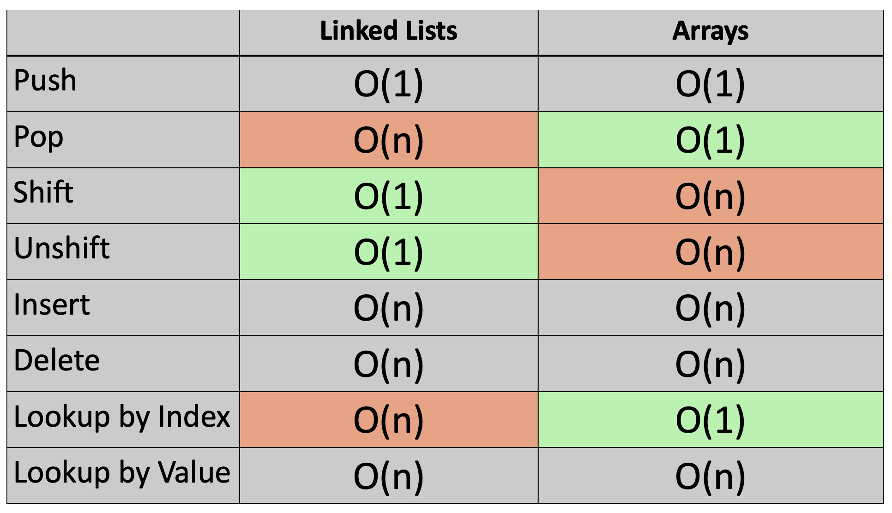

# Linked Lists Notes

## Resources

---

## What are Linked Lists?

- Linked Lists do not have indexes
  - Linked Lists have a head (points to first item)
  - Linked Lists have a tail (points to the last item)
  - Each item in the linked list points to the nex item, then to the next,
  - The last item points to null (also called null-terminated list)
- Arrays are in contigous places in memory
- Linked lists can be all over the place in memory

## Big O of Linked Lists

- Looking up value or looking by index is O(n)
- Adding and removing from the beginning of a Linked List is O(1)

## Using a Linked List vs an Array

- When to use a Linked List vs an Array
  - Adding and removing items (shift & unshift) from the front of a list are better for linked lists
  - Pop and Looking up by index are better for Arrays



## What is a Node?

- A node is an object made up of an `value` and a `pointer`

Resprenting a Linked List:

```
{
  head: {
        value: 11,
        next: {
              value: 3,
              next: {
                    value: 23,
                    next: {
                          value: 7,
                          next: {
                                value: 4,
                                next: null
                                }
                          }
                    }
              }
        }
}
```
